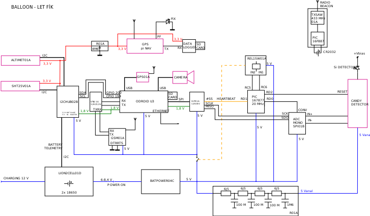

# High-altitude balloon experiment

Repository contains source files for high altitude balloon experiment. The experiment measures primarily cosmic rays by Silicon semiconductor detector.

The electronics hardware is made from [MLAB](http://www.mlab.cz/) opensource components. 

