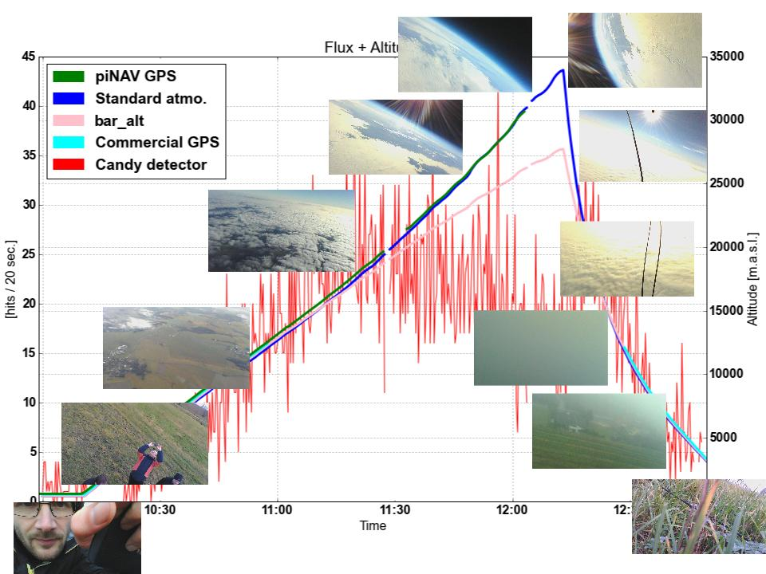

# High-altitude balloon experiment

Repository contains source files for high altitude balloon experiment. The experiment measures primarily cosmic rays by Silicon semiconductor detector.

The goal of the experiment was verification of use stratospheric sounding balloon as tool for dosimetry along with science popularization.

The electronics hardware is made from [MLAB](http://www.mlab.cz/) open-source components.
