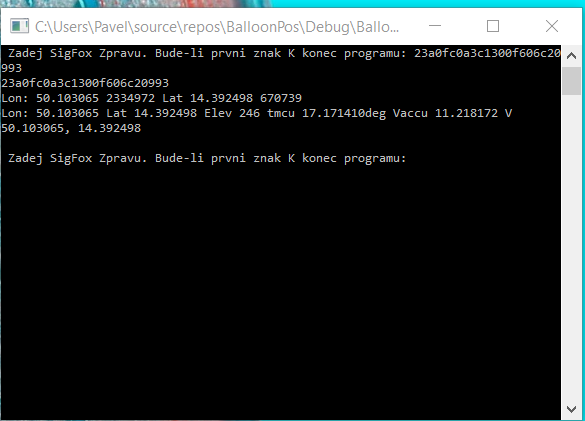
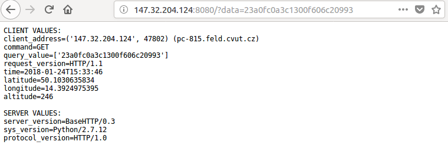

# CLI based Balloon telemetry decoder 

### Compilation

    gcc BalloonPos.cpp -o BalloonPos

### Usage 

    ./BalloonPos

Then enter the sigfox message. For example: 23a0fc0a3c1300f606c20993
You should get following as output: 

# Web based Balloon telemetry decoder 

### Usage 

    python habitat_sigfox_uploader.py LetFik3

### Testing
 
    curl -G --data "data=23a0fc0a3c1300f606c20993" localhost:8080

