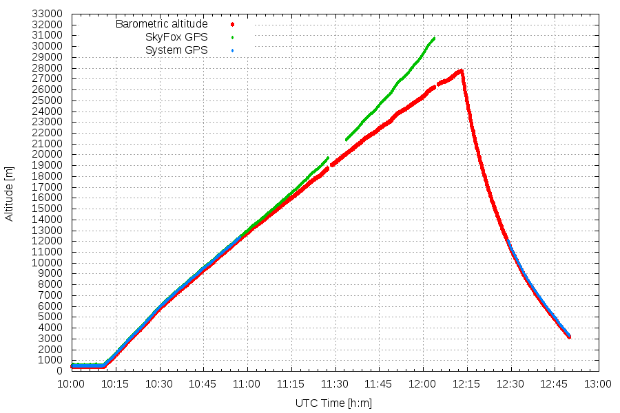

# Balon data

## SkyFox data parsing

GPS dat from SkyFox GPS were parsed by nmea_filter.pl, the output being kovarova_gps.csv, with time, lat/lon and altitude [m].
Data before 10 AM were removed, two lines with obvious read errors were corrected.

## Data correction

data_log.csv was parsed and corrected in two steps, first, oprav.py was used to compensate for a formatting/print error in case of missing GSM signal. Output is in data_corrected.csv. 

Second, the timestamps for each record were generated using matched RTC:GPS time pairs where available. For the third reboot a time delay for boot, as derived from pressure curve, was manually adjusted, as there were no GPS fixes available in that area.
This is implemented in oprav_cas.py.

### Plotting

Gnuplot was used to plot the three altitude data sources together.

System GPS lost fix at 12373.5 m and regained it at 12094.1 m during descent.
Barometric altitude data show the SkyFox GPS lost signal before baloon burst and suggest that the burst happened at about 32-33 km altitude. 

