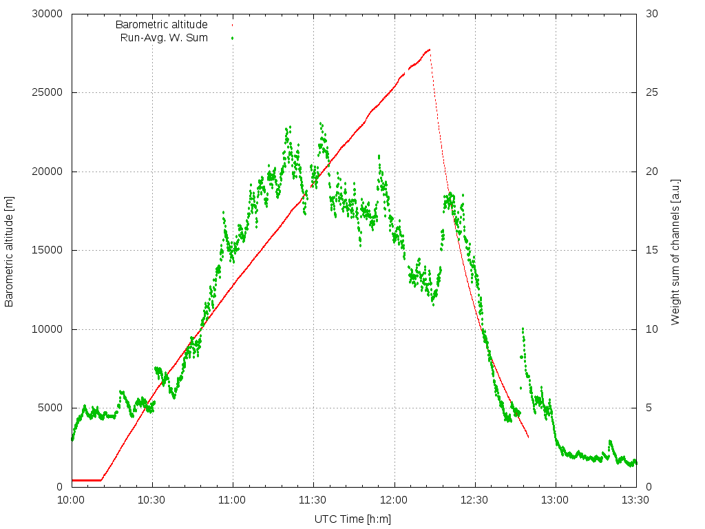

# Balon data

## PCRD: Converting system RTC time data to UTC

Boot 6 data were removed from pcrd_data.csv and the resulting file was parsed
via timesplit.py into pcrd_split.csv, to mark reboots.  Time corrections
retrieved from data_final.csv by get_corrections.py were noted at each boot
start in pcrd_split.csv and the file was parsed using oprav_pcrd.py to get
pcrd_final.csv, with UTC time as first column.

Finally, impulse counts from channels were aggregated using aggregate_pcrd.py
to pcrd_aggr.csv and plotted via Gnuplot (plt script).

